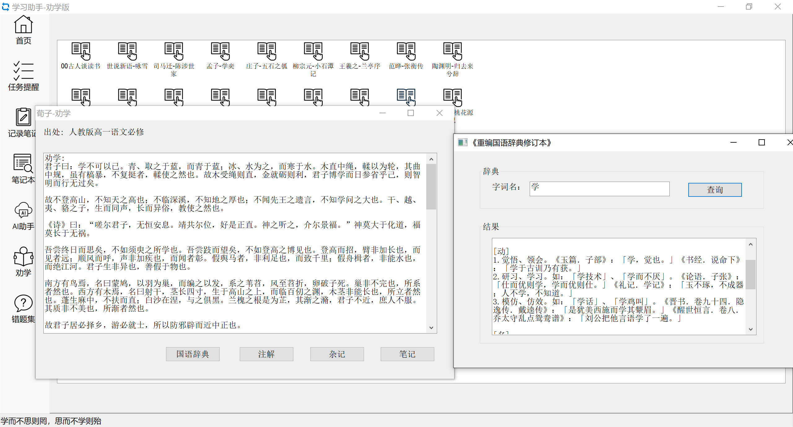
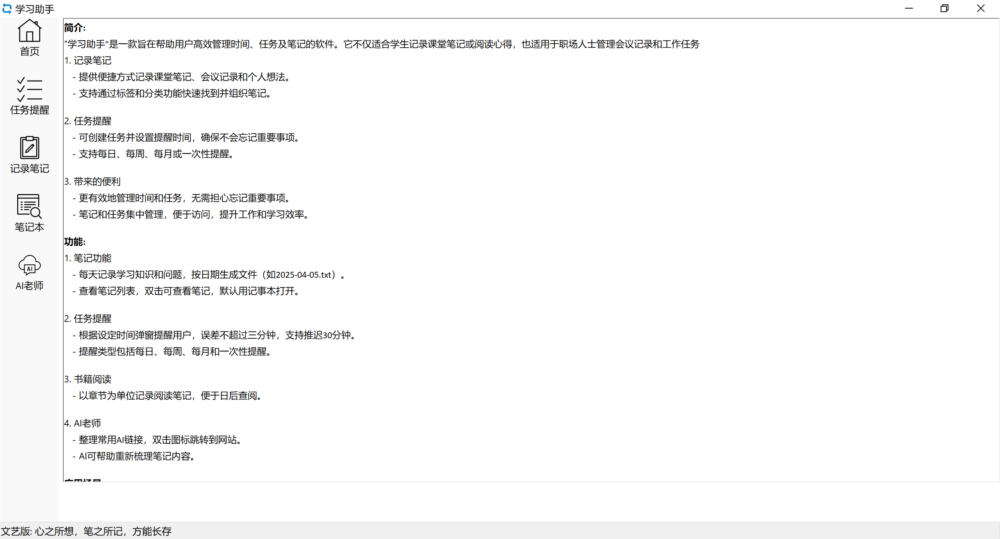
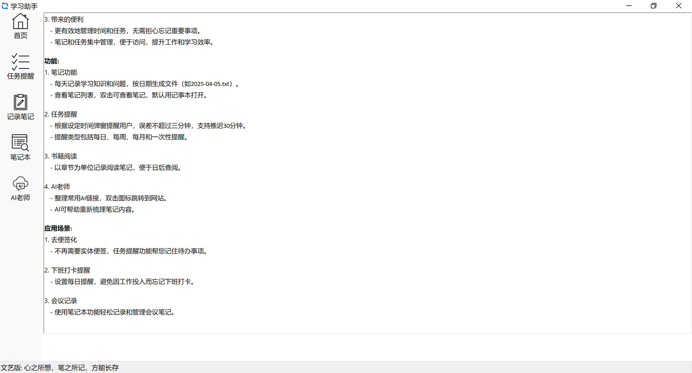
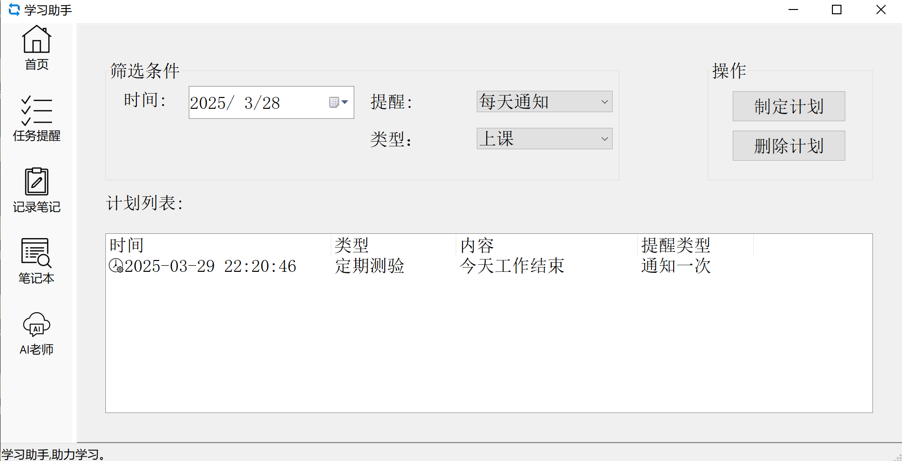
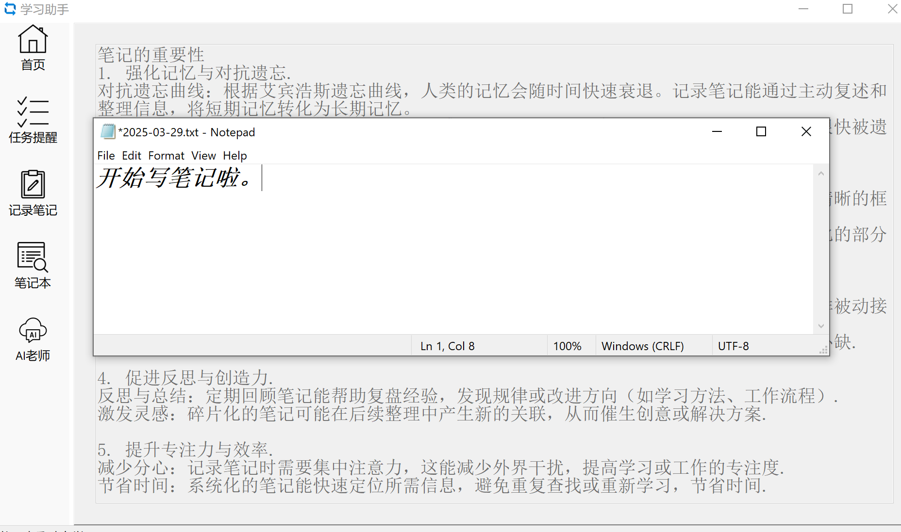
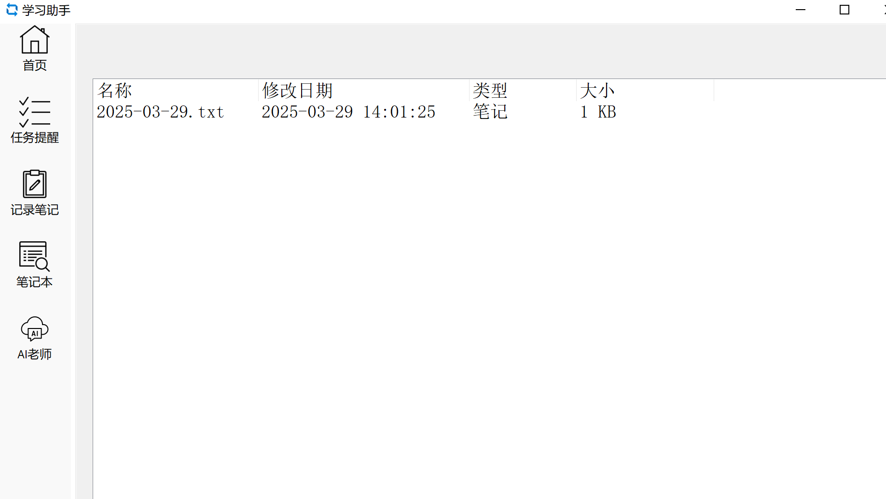
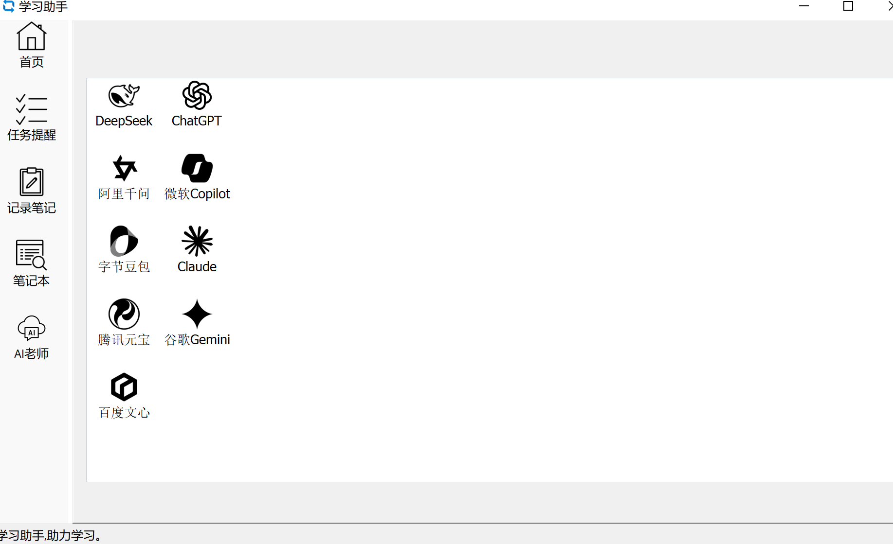

# 介绍
## 记录笔记
这个工具提供了一个方便的方式来记录笔记。无论是课堂笔记、会议记录，还是个人想法，你都可以快速地创建和管理笔记。通过使用标签和分类功能，你可以轻松找到并组织你的笔记。

## 任务提醒
这个工具还具有任务提醒功能。你可以创建任务，并设置提醒时间，以确保你不会忘记重要的事情。无论是学习任务、工作任务，还是生活中的琐事，这个工具都能帮助你保持有序。

## 带来的便利
通过这个工具，你可以更有效地管理你的时间和任务。你再也不用担心忘记重要的事情，也不用担心找不到之前的笔记。同时，所有的笔记和任务都集中在一个地方，便于访问和管理。这个工具将大大提高你的工作和学习效率，让你的生活更加井井有条。
## 学习助手-劝学版

将小学到高中课本中出现的古诗词进行了整理。
古诗词
	小学：111首
	初中：72首
	高中：40首
文言文：
		50余篇

辞典：辞典来源于 台湾-国语辞典，收录了十六万多个字词。

督促你的小孩在小学就背诵完这些古诗词和文言文。 
从考试的角度来说。可以化整为零，考试降低古文丢分的概率 
从人生的角度来说。早点接触这些有哲理的文言文。随着时间的成长，慢慢去体会其中的哲理。
闲鱼: https://m.tb.cn/h.6OY0lcf?tk=Y8AEVeEmmFm 

