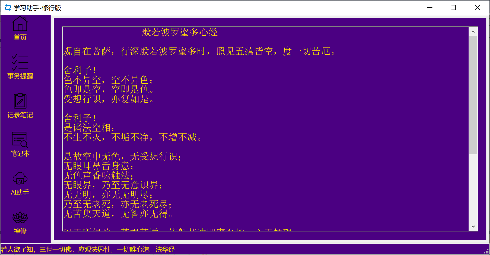

# 介绍
## 记录笔记
这个工具提供了一个方便的方式来记录笔记。无论是课堂笔记、会议记录，还是个人想法，你都可以快速地创建和管理笔记。通过使用标签和分类功能，你可以轻松找到并组织你的笔记。

## 任务提醒
这个工具还具有任务提醒功能。你可以创建任务，并设置提醒时间，以确保你不会忘记重要的事情。无论是学习任务、工作任务，还是生活中的琐事，这个工具都能帮助你保持有序。

## 带来的便利
通过这个工具，你可以更有效地管理你的时间和任务。你再也不用担心忘记重要的事情，也不用担心找不到之前的笔记。同时，所有的笔记和任务都集中在一个地方，便于访问和管理。这个工具将大大提高你的工作和学习效率，让你的生活更加井井有条。
## 学习助手-劝学版

将小学到高中课本中出现的古诗词进行了整理。 
古诗词 
	小学：111首 
	初中：72首 
	高中：40首 
文言文： 
		50余篇 
  
### 支持文言文和古诗的扩展 
添加古文， 
方法1.新建后缀名为.Chapter文件(文件编码UTF-8)。拷贝到XueXiZhuShou\QuanXue目录下 
方法2.找到XueXiZhuShou\QuanXue目录下，以.Chapter命名的文件。复制一份，修改文件名。拷贝文章内容即可。推荐此方法不用改编码格式。 
方法3.给本人发邮件。注明要添加的文章。邮箱：XiaoHeLiuShui2025@outlook.com  
例如 : 新加 荀子-修身.Chapter 拷贝到 XueXiZhuShou\QuanXue目录下，即可完成添加。重新启动程序显示成功。

## 学习助手-劝学版-辞典篇
辞典：辞典来源于 台湾-国语辞典，收录了十六万多个字词。 

督促你的小孩在小学就背诵完这些古诗词和文言文。  
从考试的角度来说。可以化整为零，考试降低古文丢分的概率  
从人生的角度来说。早点接触这些有哲理的文言文。随着时间的成长，慢慢去体会其中的哲理。 
闲鱼: https://m.tb.cn/h.6OY0lcf?tk=Y8AEVeEmmFm  

未来功能： 
1.还会继续加入，4000个成语。著名释义和典故。方便每日学习一个成语。 
其他功能待定 
## 学习助手-修行版
修行篇是为爱好佛学。想研究佛学的人推荐几本经典的书籍。
其中藏族书籍:透过佛法看世界，次第花开，寂静之道。
佛经： 心经，金刚经，坛经。
道：道德经。
修行-书籍.7z 网上搜集的EPUB格式书籍，解压到XueXiZhuShou\XiuXing目录就可以了。但请支持正版

